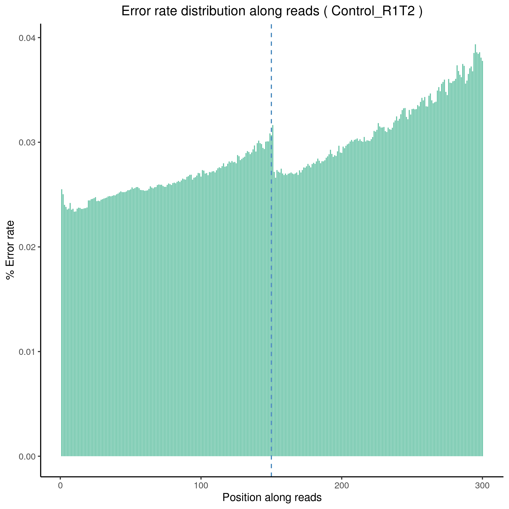
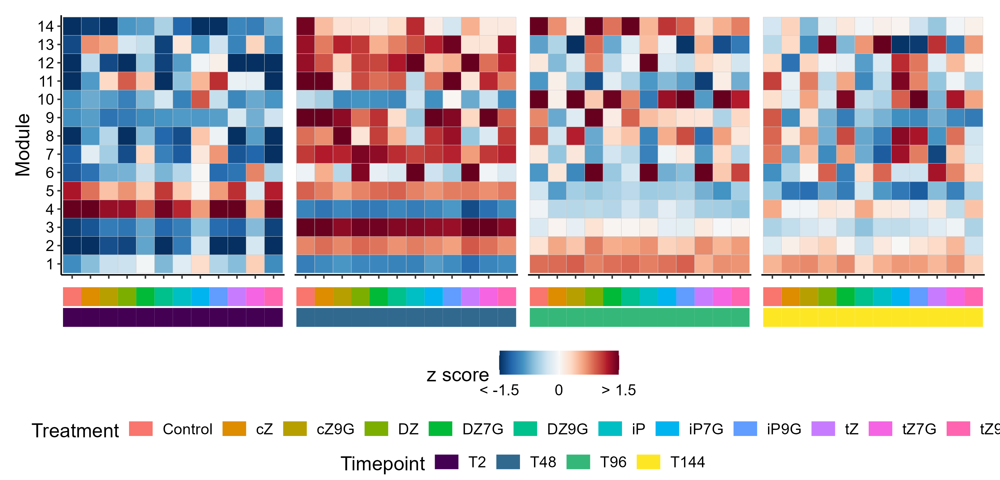
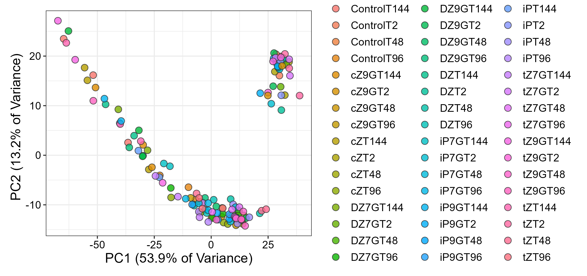

# Purpose of these scripts
Is to analyze RNA-Seq raw data generated by Illumina sequencing from quality assessment to co-expressino analysis. The organims used in this script is Arabidopsis thaliana a model plant that is widely used in plant sciences. 

The purpose of RNA-seq data is to identify the differences between 12 cytokinin "plant hormone" treatments on Arabidopsis leaves in terms of  co-expressed clusters of genes in the CK-treated leaves during leaf senescence. AT leaves were placed upon treatment either for 2 hours, 48 hours, 96 hours, or 144 hours. Samples then were taken at the designated time point for RNA-extraction and were sent to for sequencing by NovaGene Inc. 

Packages used and the purpose of each of them:

- Ensuring the **quality** of reads with `Fastqc` to assess the quality of the Illumina read data. 
- **Trimming** (post-cleaning) with `trimmomatic` to remove Illumina adaptors, and generally done to improve the quality of the data. 
- **Trimming** (after trimmomatic) using `cutadabt` to improve the quality of the data 
- ** Mapping to a reference genome using `Hisat` to align the trimmed read to a reference genome. 
- Producing **gene counts** with `stringtie ` it produces the gene count of the reads for each of the treatments in their experiment. 
- **Co-expressino analysis** using `Tidyverse` to produce modules of set of genes that are co-expressed either up- or down-regulated in each of the treatments and time ponits. 

# Languages used in this script: 
- Bash 
- Python
- R 

# Scripts included for RNA-seq data analysis: 
There are four scripts in this page;

- the first one is `FASTQC.sh` which assess the quality of the data 
- `Trimming.sh` which removes the adabtors from the raw reads, and improves the quality of the data by using two packages to do so. 
- `Mapping.sh` to align the reads to a reference genome in this case: "TAIRE 10" Arabidopsis thaliana genome. And to produce gene count matrix that is going to be used for the co-expression analysis, and also could be used in differential gene expression using edgeR or Dseq2. 
- `Co-expressionOHSamples.R` co-expression analysis, which produces PCA plots, Co-expression Heatmap of the data. 


## Quality Control 





Usually we assess the quality of the raw reads before doing any trimming step, and then run fastqc once again to compared the quality before and after trimming. The fastqc is modified in a way to make it easy to run one more time on the trimmed reads, you just have to change the path and the variables. 

``` 

cd $QUALITY_DIR/$PRE_CLEAN_QUALITY
OUTPUT_NAME=fastqc_results
tar cvzf $OUTPUT_NAME.tar.gz $QUALITY_DIR/$PRE_CLEAN_QUALITY/*

echo "Script completed."


```


After unziping the tar.gz file you would expect to have have a .gz file and HTML file, the HTML file will include the the qulaity of the reads, it will include different factors used to assess the qualtiy of the data, such as GC content, phred quality, and error rate. 

## Mapping and gene count 

As well as the other scripts in this respirtory, the script is soft coded and includes echo commands across different stages of the script to let you know the progress of the job. 

The parameters in the code below can be changed based on the computer you're running the script on, after completing this Hisat step and giving you this message "Copying files to results directory..." You would expect to set of bam, sam, and stat files in your result directory and you would see the count_gene_matrix.csv file which we will use in the R for the co-expression analysis


```
# Loop through all unique FASTQ files and map them to the reference genome
echo "Processing FASTQ files..."
while read i; do
  echo "Processing sample $i..."
  hisat2 -p 6 --dta --phred33 -x "$REFD"/AT_index -1 "$CLEAND"/"$i"_1_paired.fastq -2 "$CLEAND"/"$i"_2_paired.fastq -S "$i".sam
  samtools view -@ 6 -bS "$i".sam > "$i".bam
  samtools sort -@ 6 "$i".bam "$i"_sorted
  samtools flagstat "$i"_sorted.bam > "$i"_Stats.txt

  mkdir "$COUNTSD"/"$i"
  stringtie -p 6 -e -B -G "$REFD"/"$REF".gtf -o "$COUNTSD"/"$i"/"$i".gtf -l "$i" "$MAPD"/"$i"_sorted.bam
done < list
echo "Copying files to results directory..."

```

## Co-expression analysis

The end goal is to create a heatmap of the modules there is a detailed annotation in the script to help you change the variables based on your data. This script also includes making PCA graphs, you can make any comparisions you want based on the input data file, I compared treatments in seperate time points, or comparing the same treatment in different time point. Obviously based on the purpose of your research. 





You  can determine the set of colors of the PCA plot using brewer.pal but because I have more than 8 inputs which I am not using it. The parameter in this code is the Group, you can replace "Group" to any other parameter in your metadata. 
```
PCA_by_Group <- PCA_coord %>% 
  ggplot(aes(x = PC1, y = PC2)) +
  geom_point(aes(fill = Group), color = "grey20", shape = 21, size = 3, alpha = 0.8) +
  #scale_fill_manual(values = brewer.pal(n = 8, "Accent")) +
  labs(x = paste("PC1 (", pc_importance[1, 2] %>% signif(3)*100, "% of Variance)", sep = ""), 
       y = paste("PC2 (", pc_importance[2, 2] %>% signif(3)*100, "% of Variance)", "  ", sep = ""),
       fill = "Group") +  
  theme_bw() +
  theme(
    text = element_text(size= 14),
    axis.text = element_text(color = "black")
  )

#Print the plot as output to view
PCA_by_Group


```




# References

Quality assessment and Mapping scripts were originally written by Dr. Tonia Schwartz an Associate professor in the biological department, Auburn University. Modified by Omar Hasannin to analysis Arbaidopsis RNA-seq data. You can find the original scripts in the this link: https://github.com/Schwartz-Lab-at-Auburn/FunctionalGenomicsCourse


The reference genome in this script has been downloaded from TAIR, as well as the functional annotation file for the co-expressin analysis. 
